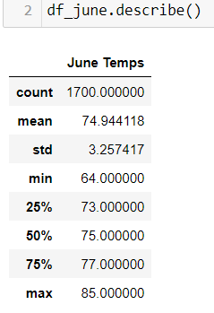
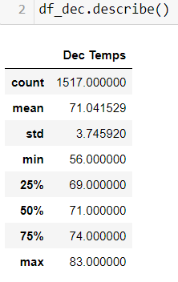
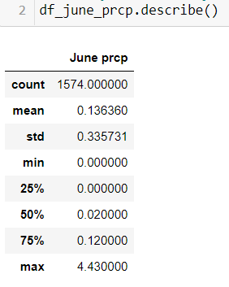
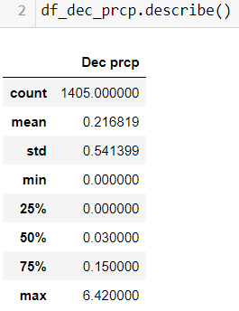
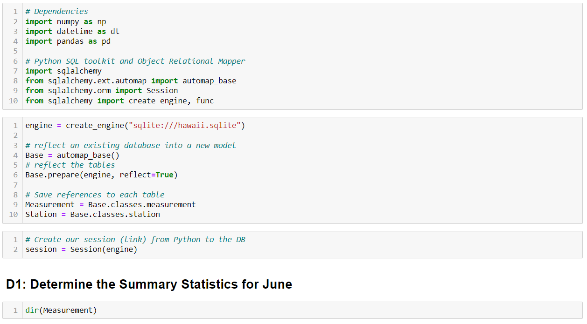
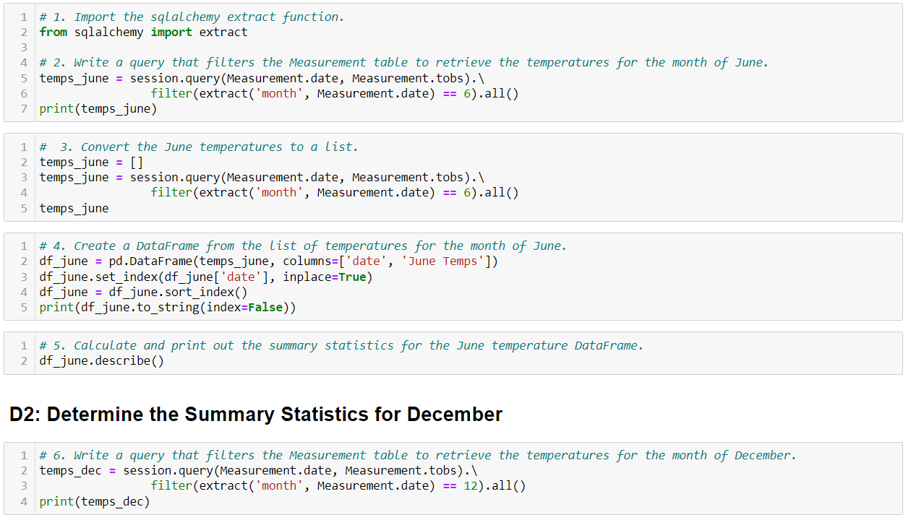
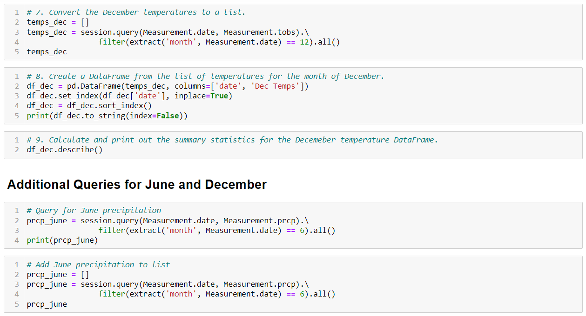
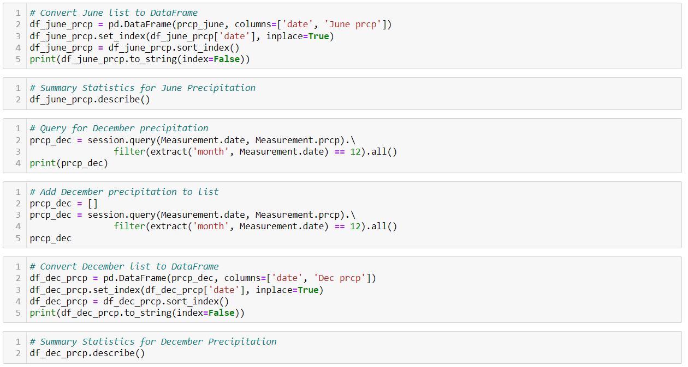

# Surfs_Up

## Overview of Project  

**Purpose:**  
The purpose of this project is to propose a business plan to investors to invest in opening a surf and shake shop, a surf shop that also sells ice cream, in Hawaii. An investor, W. Avy asked us to perform weather analytics for the potential location of the surf shop.

## Resources:  
- Data Source: hawaii.sqlite  
- Software: Python 3.9.7, Jupyter Notebook 6.4.6, Flask 1.1.2, SQLite3 3.36.0  

## Analysis and Results  

**Analysis:**  
For this analysis, we extracted data from our hawaii.sqlite file. This file contains information of past weather data for temperature, precipitation, date, and the number of weather stations where the data was taken from. We performed queries to extract the data form our hawaii.sqlite file and transformed the data in Jupyter Notebook into lists, then dataframes. We also calculated the summary statistics of the months that we are interested in providing for our investors.

After cleaning all the data, we combined all the data that we need into a single dataframe. From there, loading the data into SQL tables was the simple and easy part.

**Results:**  
From the steps in our analysis, we extracted temperature data for the months of June and December. In the month of June, we found out that the average temperature is 74.9 degrees and 71 degrees for December. We also performed calculations for precipitation, as that can also effect the success of our surf and shake shop. The average precipitation is 0.14 inches in June and 0.2 inches in December.  
   
   

## Challenge Summary  

**Summary**  
The purpose of this project is to propose a business plan to investors to invest in opening a surf and shake shop in Hawaii. We performed analytics on weather data in Hawaii as weather can effect the success of our surf shop. We calculated that the general temperatures and precipitation readings show that there will be many warm days for people to surf and enjoy ice cream from our surf shop. The precipitation for the months of June and December are look from the past years, therefore we can predict that there will be less rainy days to prevent people from going to the beach to surf.  

### Codes Used  
  
  
  
  